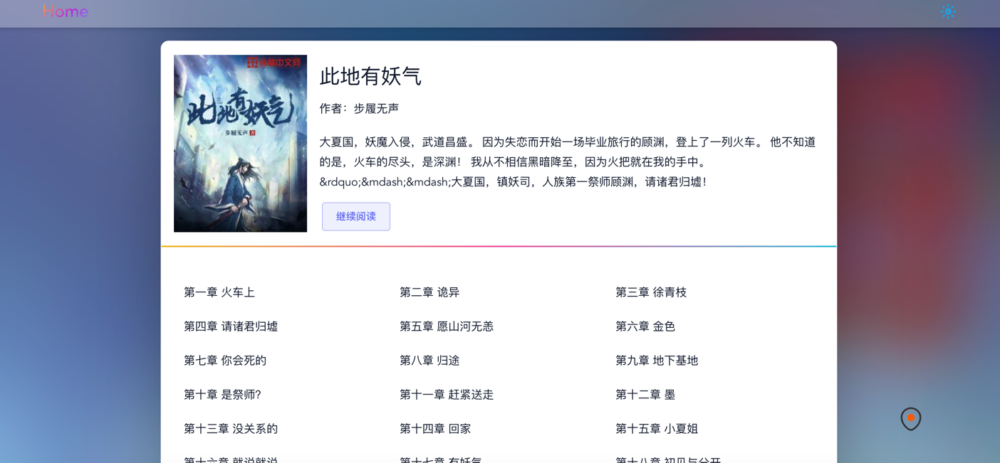
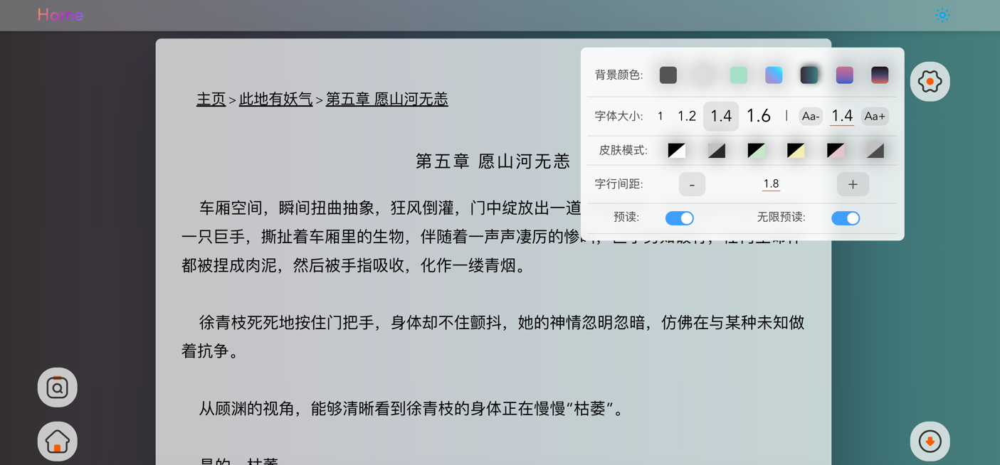

# book_go_v3
基于Gin + Vue3 的小说练习Demo
```使用到技术栈
Go1.9 
Mysql 
Redis
Viper
Gorm
```
代码质量很差 仅供学习参考
Demo：xs.wzjshe.com  
sql表基于：ShipSay分表版

Demo简介：只需要一个小说数据库 简单配置
既可以拥有自己的小说网站  

## 前端来自xccccccy/ book-vue3
    https://github.com/xccccccy/book-vue3
## 图片：
# book_go_v3
# book_go_v3
# book_go_v3
# book_go_v3
